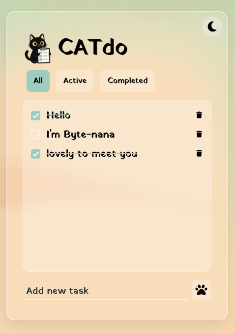
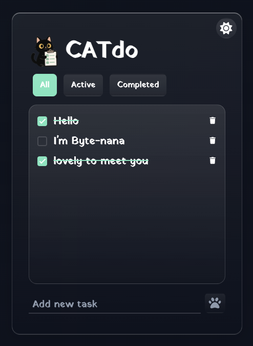

<div align="center">


# 🐾 CATDO — A Minimal To-Do App


</div>

A clean, cat-inspired **to-do list web app** that helps you organise your day with simplicity and a touch of playfulness.  
Built with **HTML, CSS (glassmorphism + dark mode)**, and **Vanilla JavaScript**, it stores your tasks locally and adapts to your preferred theme.

> 🧩 Version 1.0.0 — Initial release featuring add/delete tasks, filters, and dark/light mode toggle.

---

## 🎮 Live Demo

🎥 **Watch the Demo:**

<div>
    <a href="https://www.loom.com/share/2cbf5eca4bd44cdba9f2f4b4cc13fd89">
    </a>
    <a href="https://www.loom.com/share/2cbf5eca4bd44cdba9f2f4b4cc13fd89">
      
    </a>
  </div>

🔗 [**Try CATDO on Netlify ↗️**](https://bytenanatodoapp.netlify.app/)

---

## 💡 Project Overview

**CATDO** is a minimalistic to-do list app designed for users who want a calm, focused interface with a fun twist.  
Tasks are automatically saved in the browser’s **localStorage**, so you’ll never lose your progress — even after refreshing.  
Switch between **light and dark themes**, and use filters to manage your daily workflow with ease.

---

## 🧩 Key Features

| Feature                 | Description                                       |
| :---------------------- | :------------------------------------------------ |
| 📝 **Add Tasks**        | Quickly add new to-dos via the bottom input form. |
| ✅ **Mark Complete**    | Tick tasks to mark them as completed.             |
| ❌ **Delete Tasks**     | Remove items instantly with the trash icon.       |
| 🐾 **Filter Tasks**     | Toggle between _All_, _Active_, and _Completed_.  |
| 🌙 **Dark Mode**        | Light and dark themes with saved preference.      |
| 💾 **Local Storage**    | Persistent tasks, filters, and theme settings.    |
| 💎 **Glassmorphism UI** | Soft, blurred, modern interface design.           |

---

## 🧠 Tech Stack

| Layer   | Technology                                                  |
| :------ | :---------------------------------------------------------- |
| Markup  | HTML5                                                       |
| Styling | CSS3 (Variables, Glassmorphism, Media Queries, Transitions) |
| Theme   | Dark Mode using CSS Variables                               |
| Logic   | Vanilla JavaScript (ES6 syntax)                             |
| Storage | Browser `localStorage` API                                  |

---

## 📁 Folder Structure

```
.
├── css
│ ├── style.css
│ └── darkMode.css
├── image
│ ├── logo.png
│ └── favicon/
│ ├── favicon.ico
│ ├── favicon-16x16.png
│ ├── favicon-32x32.png
│ ├── apple-touch-icon.png
│ ├── favicon.svg
│ └── site.webmanifest
├── index.html
├── src
│ └── main.js
└── README.md
```

---

## 🧭 How It Works

- **Add tasks** with the text field at the bottom.
- New items are rendered inside the main list.
- Click a checkbox to mark items as completed.
- Use filter buttons to display _All_, _Active_, or _Completed_ tasks.
- Switch between 🌞/🌙 theme modes — the preference is saved.
- All data is persisted using **localStorage**.

---

## 🪄 UI Design

|                 Light Mode                  |                 Dark Mode                 |
| :-----------------------------------------: | :---------------------------------------: |
|  |  |

---

## 🧩 Future Enhancements

- ✨ **Smooth animations for adding/removing items**
- 📱 **Enhanced mobile gestures**

---

## 📚 Learning Highlights

- Dynamic DOM manipulation with ES6.
- Event delegation for efficiency.
- Working with arrays of objects to represent tasks.
- Dark mode handling with CSS variables.
- Using the browser’s local storage for persistence.

---

## 👩‍💻 About the Developer

**Developed by [Byte-nana](https://github.com/byte-nana)**  
Aspiring front-end developer passionate about building **playful, accessible, and visually polished web apps**.

---

## 🧾 Licence

Released under the [MIT Licence](LICENSE).

---

<div align="center">
  <sub>Made with 🐾 and curiosity in London • 2025</sub>
</div>
